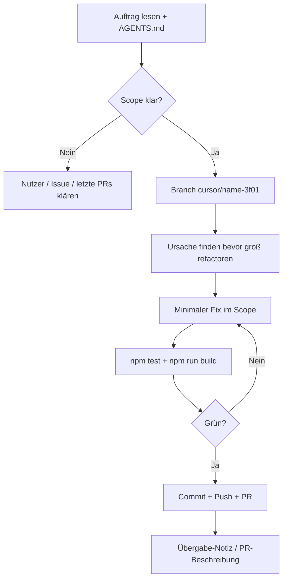

# Agent-Workflow — Chess-game

Dieses Dokument ist die **Single Source of Truth** für alle Agenten (Cursor Cloud, andere KI-Assistenten, Menschen), die an diesem Repository arbeiten. **Vor jeder Aufgabe lesen und am Ende den Abschnitt „Übergabe“ ausfüllen bzw. aktualisieren.**

---

## 1. Projektüberblick

| Bereich | Pfad | Kurzbeschreibung |
|--------|------|------------------|
| **Klassisches Schach** | `src/classic/` | 2D-Brett, chess.js, Computergegner (Worker + Minimax) |
| **3D Tri-Schach (CG-TDC v1)** | `src/tridimensional/` | Three.js, eigene Regeln/Move-Engine, optional Bot |
| **Einstieg UI** | `src/main.js`, `index.html` | Moduswahl Classic vs. 3D |
| **Build / Pages** | `vite.config`, `docs/` | `base: /Chess-game/`, Deploy aus `docs/` |

**Regeln:** `src/tridimensional/rules/RULES.md`, `cgTdcV1Rules.js`

**Nicht verwechseln:** Classic-Bot ≠ Tri-Bot. Änderungen am Classic-AI-Code berühren **nicht** automatisch 3D — und umgekehrt, sofern die Aufgabe das nicht verlangt.

---

## 2. Standard-Prozess (jede Aufgabe)



### 2.1 Pflicht vor Codeänderungen

1. **Scope** notieren: Classic / 3D / beides / nur Deploy.
2. **Git:** Letzten funktionierenden Stand vs. Regression vergleichen (`git log`, `git diff`), wenn Bugfix.
3. **Keine** Phase 1/2 neu implementieren, wenn nur Phase 3 oder ein Bugfix gefragt ist (Historie: Phase 1 Basis, Phase 2 Regeln/UI, Phase 3 Computer).

### 2.2 Pflicht nach Codeänderungen

```bash
npm test
npm run build
```

- Tests und Build müssen grün sein, bevor ein PR als fertig gilt.
- `docs/` nur committen, wenn die Aufgabe ausdrücklich Build-Artefakte für Pages verlangt; sonst reicht Source — der Pages-Workflow baut auf `main`.

### 2.3 Git & PR

| Regel | Wert |
|--------|------|
| Branch-Präfix | `cursor/` |
| Branch-Suffix | `-3f01` |
| Beispiel | `cursor/fix-classic-bot-timeout-3f01` |
| Push | `git push -u origin <branch>` |
| PR | Tool `ManagePullRequest`, Base meist `main` |
| Commits | Imperativ, englisch oder deutsch, eine Zeile + optional Body |

---

## 3. Architektur-Guardrails (häufige Regressionen)

### 3.1 Classic Computergegner

- Suche **nur** im Web Worker (`src/classic/engine/searchWorker.js`).
- **Zeitlimit** muss in Rekursion (Negamax, Quiescence, Move-Loops) geprüft werden, nicht nur zwischen ID-Tiefen.
- **Kein** Three.js / DOM an den Worker senden.
- **Evaluation:** FEN-Manipulation (z. B. Mobilität) darf **keine illegalen En-passant-FENs** erzeugen.
- UI: `try/finally` für „Computer denkt …“; Suche invalidieren bei Neue Partie / Undo / Moduswechsel (`invalidateComputerSearch`).

### 3.2 3D Tri-Schach

- **Renderer getrennt vom Bot:** Game State → Three.js; Bot → Worker → Zug → Move-Engine auf State.
- In `triScene.js`: DOM nur über **`this.root`**, nicht bare `root` in Methoden.
- Bot darf Scene / Camera / Canvas **nicht** steuern oder dispose’n.

### 3.3 Allgemein

- Keine Scope-Creep-Features, wenn der Auftrag „nur Bugfix“ ist.
- chess.js für Classic-Regeln nicht ersetzen.

---

## 4. Aufgaben-Checklisten

### Bugfix

- [ ] Reproduktion (Browser / Test / `node`-Skript)
- [ ] Root Cause in 1–2 Sätzen dokumentieren (PR + Nutzerbericht)
- [ ] Minimaler Diff
- [ ] Regressionstest, wenn sinnvoll (`src/**/**/*.test.js`)
- [ ] Nutzerbericht: Was / welche Phase / welche Dateien / Prävention / Tests

### Feature (nur wenn explizit gewünscht)

- [ ] Akzeptanzkriterien vom Nutzer zitieren
- [ ] Bestehende Patterns (Ordner, Benennung) kopieren
- [ ] Keine parallele Neuimplementierung einer bestehenden Phase

### Nur Analyse

- [ ] Kein Commit nötig, außer der Nutzer verlangt Dokumentation
- [ ] Trotzdem AGENTS.md-Übergabe-Vorlage für Folge-Agent nutzen

---

## 5. Übergabe an den nächsten Agenten

**Bei jedem abgeschlossenen Task** in PR-Beschreibung oder Kommentar an den Nutzer folgende Struktur verwenden (Copy-Paste-Vorlage):

```markdown
## Agent-Übergabe

**Stand:** `<branch>` / PR #`<nr>` / Commit `<sha>`

**Erledigt:**
- …

**Nicht anfassen (unless asked):**
- …

**Bekannte Fallstricke:**
- Classic: sideMobility + En passant; Worker-Watchdog
- 3D: `this.root` in triScene; Bot nicht an Renderer koppeln

**Nächste sinnvolle Schritte (optional):**
- …

**Verifikation:**
- `npm test` → …
- `npm run build` → …
```

Der Nutzer kann diese Sektion in neue Agent-Chats kopieren, damit andere Agenten sofort weiterarbeiten können.

---

## 6. Wichtige Referenzen (Historie)

| Thema | PR / Hinweis |
|--------|----------------|
| Phase 2 Merge | Regeln CG-TDC v1, Move-Engine |
| Phase 3 Tri-Bot | `src/tridimensional/ai/` |
| 3D-Brett verschwindet | `root` → `this.root` in `triScene.mount()` |
| Classic-Bot hängt | Illegal FEN in `evaluation.sideMobility`; harte Timeouts + Watchdog |

---

## 7. Lokale Entwicklung

```bash
npm install
npm run dev      # http://localhost:5173 (Base-Pfad beachten)
npm test
npm run build
```

Live: https://jrpp16.github.io/Chess-game/

---

*Letzte Workflow-Version: 2026-09-24 — bei Prozessänderungen diese Datei in derselben PR aktualisieren.*
